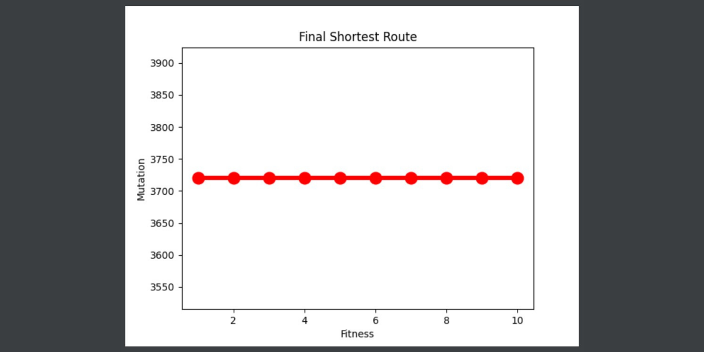

# Implementation of Genetic Algorithm in the Shortest Route Case using Python Programming Language
This is a mid-term project of the Artificial Intelligence course. In this project, I created an Implementation of Genetic Algorithm in the Shortest Route Case using Python Programming Language. 

A Genetic Algorithm is an algorithm that utilizes a natural selection process known as the evolutionary process. In the process of evolution, individuals are constantly changing their genes to adapt to their environment. "Only strong individuals can survive". This natural selection process involves gene changes that occur in individuals through the process of reproduction. 

There are five steps in the genetic algorithm cycle that I implemented in my project such as initialization population, fitness evaluation, selection of individual, reproduction (cross-over and mutation), and then it will create a new population. After creating a new population, it will go again to the fitness evaluation step and repeat the other steps until it gets the final population and becomes the best population.  

For more detail, you may check the documentation that I attached in the code.

